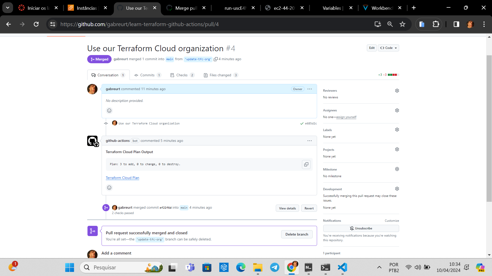
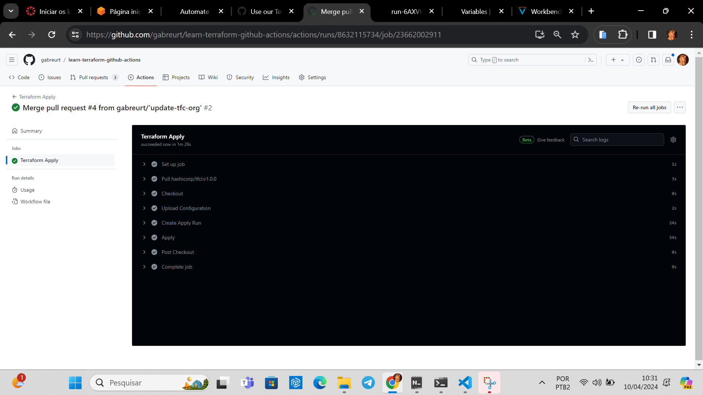
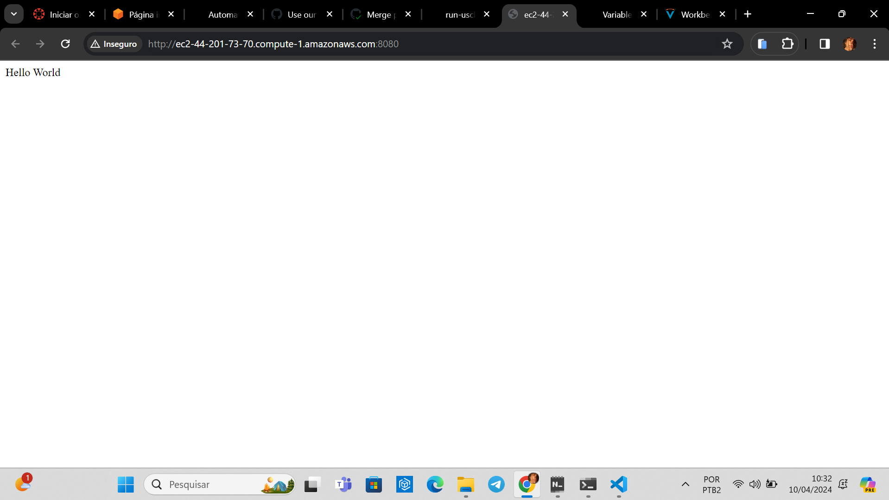
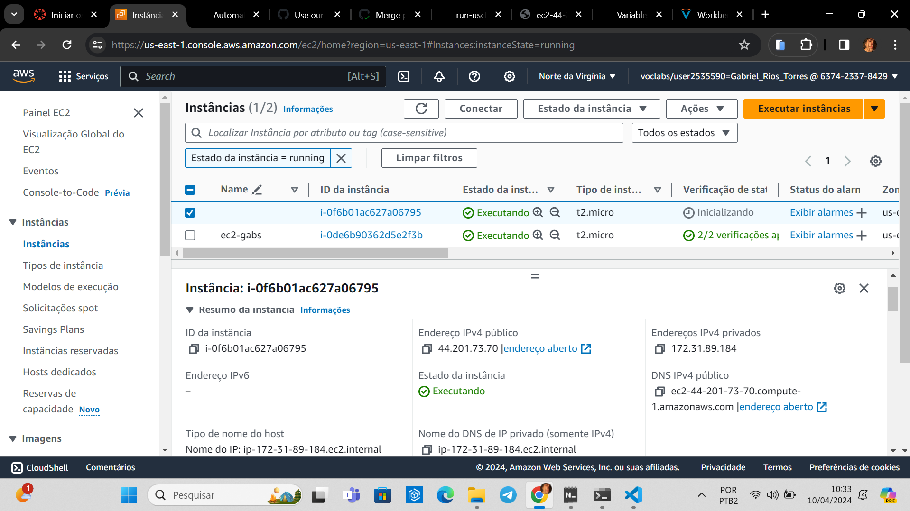

# Relatório: Automação do Terraform com GitHub Actions
Este relatório fornece um resumo detalhado do tutorial "Automate Terraform with GitHub Actions", que explora a integração entre o GitHub Actions e o Terraform Cloud para automatizar o processo de implantação de infraestrutura.

## Tecnologia e Conceitos
### GitHub Actions
GitHub Actions é uma ferramenta que adiciona integração contínua a repositórios no GitHub, permitindo automatizar a construção, testes e implantações de software. Isso é realizado por meio de workflows definidos em arquivos YAML, que descrevem uma série de etapas a serem executadas em resposta a eventos específicos, como push de código ou pull requests.

### Terraform
Terraform é uma ferramenta de infraestrutura como código (IaC) desenvolvida pela HashiCorp. Permite definir, criar e gerenciar infraestrutura de forma declarativa, facilitando a criação e manutenção de ambientes de infraestrutura complexos.

### Terraform Cloud
Terraform Cloud é uma plataforma oferecida pela HashiCorp para colaboração e automação de fluxos de trabalho de infraestrutura. Permite armazenar e gerenciar o estado da infraestrutura, colaborar em equipe e integrar-se a ferramentas de CI/CD, como o GitHub Actions.

### CI/CD (Integração Contínua/Entrega Contínua)
CI/CD é uma prática de desenvolvimento de software que visa automatizar o processo de construção, teste e implantação de código. A Integração Contínua (CI) envolve a automação de compilação e testes sempre que há uma alteração no código fonte, enquanto a Entrega Contínua (CD) automatiza a implantação de código em ambientes de produção.

## Resumo do Tutorial
O tutorial "Automate Terraform with GitHub Actions" demonstra como criar um fluxo de trabalho automatizado usando GitHub Actions para implantar uma instância de servidor web publicamente acessível dentro de um espaço de trabalho do Terraform Cloud. Durante o tutorial fizemos os seguintes passos:

1. Configuração do Terraform Cloud e GitHub Repository Setup: Configurar um espaço de trabalho no Terraform Cloud, adicionar credenciais da AWS e gerar um token de API do Terraform Cloud.

2. Configuração do Repositório do GitHub: Configurar um novo repositório no GitHub, cloná-lo localmente e configurar segredos para armazenar o token de API do Terraform Cloud.

3. Revisão dos Workflows do GitHub Actions: Revisar os arquivos YAML que definem os workflows do GitHub Actions para planejar e aplicar as configurações do Terraform.

4. Criação de Pull Request e Implantação: Criar uma nova branch, fazer alterações nos arquivos de configuração do Terraform, abrir um pull request e revisar a implantação da infraestrutura na Terraform Cloud.

5. Verificação da Implantação: Verificar se a instância do EC2 foi provisionada corretamente acessando o link fornecido na Terraform Cloud e testando a conexão com a instância por meio de um navegador ou ferramenta de linha de comando.

## Resultados
### Pull request

### Fim do merge

### Imagem no Terraform

### Resposta do EC2

### EC2 na AWS

## Conclusão
O tutorial fornece uma introdução prática à integração entre o GitHub Actions e o Terraform Cloud, demonstrando como automatizar a implantação de infraestrutura de forma eficiente e colaborativa. 
